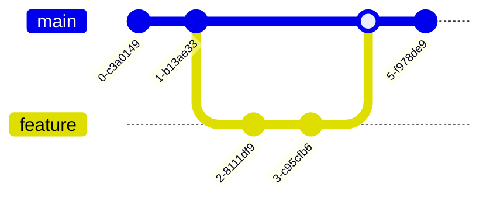

# Mermaid Sketch Theme Guide

## Overview

The interactive book now includes **Mermaid.js** with a custom **Sketch Theme** that matches the hand-drawn aesthetic of the scanner interface.

## Features

✅ **Patrick Hand font** - Matches the main book typography
✅ **Wobbly borders** - Hand-drawn style border-radius
✅ **Dashed lines** - Sketchy connector lines
✅ **Custom colors** - Matches your color palette
✅ **Fully responsive** - Works on mobile and desktop

## Setup

Already configured in `book.html`:

```html
<!-- 1. Load Mermaid.js (CDN) -->
<script src="https://cdn.jsdelivr.net/npm/mermaid@11/dist/mermaid.min.js"></script>

<!-- 2. Custom Sketch Theme CSS -->
<style>
  .mermaid {
    font-family: 'Patrick Hand', sans-serif !important;
    border: 2px dashed #bdc3c7;
    border-radius: 255px 15px 225px 15px / 15px 225px 15px 255px;
    /* ... more sketch styles */
  }
</style>

<!-- 3. Initialize with Theme Config -->
<script>
  mermaid.initialize({
    startOnLoad: true,
    theme: 'base',
    themeVariables: {
      primaryColor: '#fff',
      primaryTextColor: '#333',
      primaryBorderColor: '#333',
      fontFamily: 'Patrick Hand'
    }
  });
</script>
```

## Usage

Add diagrams anywhere in `book.html` using:

```html
<pre class="mermaid">
flowchart TD
    A[Start] --> B{Decision}
    B -->|Yes| C[Action A]
    B -->|No| D[Action B]
    C --> E[End]
    D --> E
</pre>
```

## Diagram Types

### 1. Flowcharts (flowchart)

```mermaid
flowchart TD
    A[Start Scan] --> B[Highlight Item]
    B --> C{Switch Press?}
    C -->|Yes| D[✓ Select]
    C -->|No| E[Next Item]
    E --> B
```



### 2. Sequence Diagrams (sequenceDiagram)


### 3. State Diagrams (stateDiagram-v2)


### 4. Entity Relationship (erDiagram)


### 5. User Journey (journey)


### 6. Git Graph (gitGraph)



### 7. Mind Maps (mindmap)


### 8. Timeline (timeline)


### 9. Pie Charts (pie)


## Styling Tips

### Add Custom Colors

```html
<pre class="mermaid">
flowchart TD
    A[Start] --> B{Decision}
    B -->|Yes| C[✓ Success]
    B -->|No| D[✗ Failure]

    style A fill:#3498db,stroke:#333,stroke-width:3px
    style C fill:#4CAF50,stroke:#333,stroke-width:3px
    style D fill:#f44336,stroke:#333,stroke-width:3px
</pre>
```

### Add Icons/Emojis

```html
<pre class="mermaid">
flowchart LR
    A[🎯 Goal] --> B[⚡ Action]
    B --> C[✅ Result]
</pre>
```

### Subgraphs (Grouping)

```html
<pre class="mermaid">
flowchart TD
    subgraph Input ["User Input"]
        S1[Switch 1]
        S2[Switch 2]
    end

    subgraph Process ["Scanner Logic"]
        L[Linear]
        RC[Row-Column]
    end

    subgraph Output ["Feedback"]
        SND[Sound]
        VIS[Visual]
    end

    S1 --> L
    S2 --> RC
    L --> SND
    RC --> VIS
</pre>
```

## Customization Options

### Font Sizes

```javascript
mermaid.initialize({
  themeVariables: {
    fontSize: '20px'  // Larger text
  }
});
```

### Line Styles

```javascript
mermaid.initialize({
  flowchart: {
    curve: 'basis'    // Curved (hand-drawn look)
    // or 'linear'     // Straight lines
    // or 'stepBefore' // Stepped
  }
});
```

### Arrow Styles

```html
<pre class="mermaid">
flowchart LR
    A --> B     <!-- Solid arrow -->
    A -.-> C    <!-- Dotted arrow -->
    A ==> D     <!-- Thick arrow -->
    A --text--> E  <!-- Labeled arrow -->
</pre>
```

## Advanced Features

### Animation (not recommended for print)

```html
<pre class="mermaid" data-anim="true">
flowchart LR
    A[Start] --> B[Process]
    B --> C[End]
</pre>
```

### Click Events

```html
<pre class="mermaid">
flowchart TD
    A[Start] --> B{Click Me}
    B -->|Yes| C[Result]
    click B "javascript:alert('Clicked!')"
</pre>
```

## Examples in the Book

- **Chapter 10**: Pattern comparison flowcharts
- **Efficiency Chart**: Visual comparison of 3 patterns
- More can be added anywhere!

## Resources

- [Mermaid Official Docs](https://mermaid.js.org/)
- [Mermaid Theme Configuration](https://mermaid.ai/open-source/config/theming.html)
- [Mermaid v11 Release](https://docs.mermaidchart.com/blog/posts/mermaid-v11-is-out)
- [Hand-Drawn Theme Discussion](https://github.com/mermaid-js/mermaid/issues/1886)

## Troubleshooting

**Diagrams not rendering?**
- Check browser console for errors
- Ensure mermaid.js loaded (check Network tab)
- Verify diagram syntax at [mermaid.live](https://mermaid.live)

**Wrong theme?**
- Clear browser cache
- Check CSS specificity (use !important if needed)
- Verify mermaid.initialize() called before diagrams render

**Mobile issues?**
- Use `useMaxWidth: false` in config
- Add `overflow-x: auto` to .mermaid CSS
- Test on actual devices (not just resize)

## Future Enhancements

Possible improvements:
- [ ] Add animation toggle
- [ ] Export diagrams as SVG
- [ ] Dark mode theme
- [ ] More hand-drawn SVG filters
- [ ] Custom arrow markers
- [ ] Diagram zoom/pan
