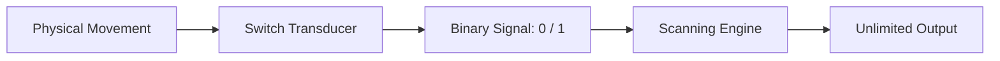

# Chapter 1: What is a Switch?

A **switch** is an assistive technology device that functions as a fundamental binary transducer: transmitting exactly one bit of information at a time—**ON** (1) or **OFF** (0). 

Unlike a standard physical keyboard offering dozens of discrete keys, or a mouse offering continuous 2D spatial coordinates, a switch represents the simplest possible digital input mechanism.

## Why Switches Matter

For individuals with severe physical disabilities (such as motor neuron disease/ALS, cerebral palsy, spinal cord injury, or brainstem stroke), a switch activation may represent the **only reliable voluntary movement** they can consistently perform. 

Software scanning transforms this single binary channel into full access to digital technology—enabling augmentative communication (AAC), environmental control (EADL), and complete computer operating system access (Damper, 1984).

## Real-World Applications

- **Augmentative & Alternative Communication (AAC):** Generating speech output, composing text messages, and participating in conversation.
- **Environmental Control:** Operating lights, televisions, doors, and hospital bed positioners.
- **Full Digital Access:** Web browsing, document editing, coding, and software navigation.

## Overview of Switch Mechanisms

While all switches output a simple binary state, physical activation mechanisms vary widely based on the user's motor profile:

- **Mechanical Press Buttons:** Activated by hand, head, chin, or foot pressure.
- **Proximity / Touchless Sensors:** Activated by bringing a body part within range without physical contact force.
- **Pneumatic (Sip-and-Puff):** Controlled by positive (puff) or negative (sip) air pressure through a straw.
- **Electromyographic (EMG) Muscle Sensors:** Detect microscopic electrical activity during muscle contraction (e.g., eyebrow twitch).
- **Optical Infrared Beams:** Triggered by breaking an light beam with finger or eye blink movement.

*(For detailed hardware selection, mounting ergonomics, and site evaluation, see Chapter 20).*

  <strong>Key Insight:</strong> A single switch translates one voluntary muscle movement into unlimited digital control. Scanning software is the mathematical engine that bridges the gap between binary input and full human-computer interaction (Fitts, 1951).

