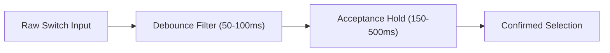

# Chapter 15: Signal Filtering & Acceptance Delay

Physical switch activations from human users are rarely pristine square waves. Muscle spasms, involuntary tremors, contact bounce, and motor fatigue introduce noise into binary switch signals.

Software-based **signal filtering** cleans raw physical switch inputs, ensuring that only intentional movements trigger scanning selections.

  💡 <strong>In Plain English (Debounce vs. Acceptance Delay):</strong> 
  • <strong>Debounce Filter:</strong> Imagine a loose doorbell that buzzes twice if you tap it once. Debounce simply tells the computer: <em>"Ignore rapid double-clicks happening within 1/10th of a second."</em>  
  • <strong>Acceptance Delay:</strong> Imagine a heavy door that requires you to lean against it for a half-second before it unlatches. If a client accidentally brushes their switch during an involuntary spasm, letting go immediately cancels the press—saving them from an unwanted mistake.

## Key Filtering Parameters

### 1. Mechanical Debounce Filter
When a mechanical switch button is depressed, the internal metallic contacts spring and "bounce" against each other for a few milliseconds, sending rapid micro-pulses (0-1-0-1) before settling into a closed ON state.

- **Debounce Threshold:** The software ignores any input state changes occurring within 50–100 ms of the initial closure.
- **Clinical Purpose:** Prevents a single physical button press from registering as multiple unintended selections.

### 2. Acceptance Delay (Hold Duration)
**Acceptance Delay** requires the user to maintain continuous physical pressure on the switch for a set hold duration before the system confirms the selection.

- **Short (150–250 ms):** Standard threshold for users with mild motor control variation.
- **Long (300–800 ms):** Tremor filtering for users with severe athetosis, chorea, or spasticity.
- **Cancellation:** If the user releases the switch before the acceptance delay timer expires, the press is discarded without output.

### 3. Post-Acceptance (Refractory Window)
After a selection is accepted, the system enforces a short **post-acceptance pause** (typically 200–500 ms) during which further switch presses are ignored.

- **Clinical Purpose:** Prevents accidental double-activation when a user struggles to release the switch quickly after making a selection.

  🩺 <strong>Clinical Rule:</strong> If a user exhibits frequent accidental double-selections or unintentional activations, increase <strong>Acceptance Delay</strong> first. If activations miss target items because holding is exhausting, reduce acceptance delay and add a <strong>Debounce Filter</strong> (Koester & Simpson, 2017).

## Timing Guidelines by Clinical Need

| Failure Mode | Underlying Motor Mechanism | Recommended Signal Filter |
| --- | --- | --- |
| Rapid double selections | Mechanical bounce or quick reflex tap | Debounce Filter: 50–100 ms |
| Accidental hits during movement | Involuntary muscle spasm / tremor | Acceptance Delay: 300–600 ms |
| Late press on second item | Delayed physical release | Post-Acceptance Window: 300–500 ms |
| Accidental trigger during rest | Accidental contact with switch | Acceptance Delay: 500–800 ms |

## Demo: Acceptance Delay in Action

  🎮 Press and <strong>HOLD</strong> the switch to trigger selection. Notice how quick taps are filtered out.

  <switch-scanner theme="sketch" scan-pattern="linear" scan-rate="1500" grid-size="9" acceptance-delay="400"></switch-scanner>

  Next Chapter: In <strong>Chapter 16</strong>, we explore continuous movement modes such as gliding cursors, crosshairs, and compass scanning.

