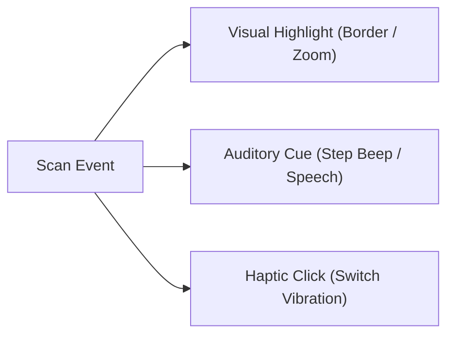

# Chapter 20: Multimodal Feedback & Auditory Scanning

Multi-sensory feedback reduces cognitive effort and reassures the user that their switch activations have been registered.

Effective feedback must operate across three distinct sensory modalities: **Visual**, **Auditory**, and **Haptic/Tactile**.

## Feedback Channels

### 1. Visual Highlighting
- **Active Focus:** High-contrast border, background hue shift, or scale elevation.
- **Background Dimming:** Non-highlighted cells dim slightly to isolate visual attention.
- **Contrast Ratios:** Ensure highlights pass WCAG AAA contrast guidelines against both light and dark themes. Avoid color-only indicators (e.g., red vs green).

### 2. Auditory Feedback & Auditory Scanning
For switch users who are blind, have low vision, or experience severe visual fatigue, **Auditory Scanning** is the primary access modality:

- **Auditory Step Beep:** A short, unobtrusive click or pitch step played on each scan step.
- **Speech Prompting:** Text-to-speech engine speaks the item or group label as it highlights (e.g., "Food... Drinks... Questions...").
- **Private Earphone Cueing:** Auditory prompts play through a private earphone, while selected output text plays through public speakers.
- **Selection Confirmation Tone:** A distinct, higher-pitched chime confirming that a selection has been committed.

### 3. Haptic & Tactile Feedback
- **Switch Click Feel:** Physical switches with crisp tactile feedback (e.g., micro-switch click) provide instant somatic confirmation.
- **Vibration Pulses:** Haptic vibration motors built into mounting arms or switches reinforce press registration for users with visual and hearing impairments.

  <strong>Best Practice:</strong> Always pair a visual highlight with a short, distinct auditory selection chime. The selection sound should sound noticeably different from the step scan beep to confirm intentional activation.

