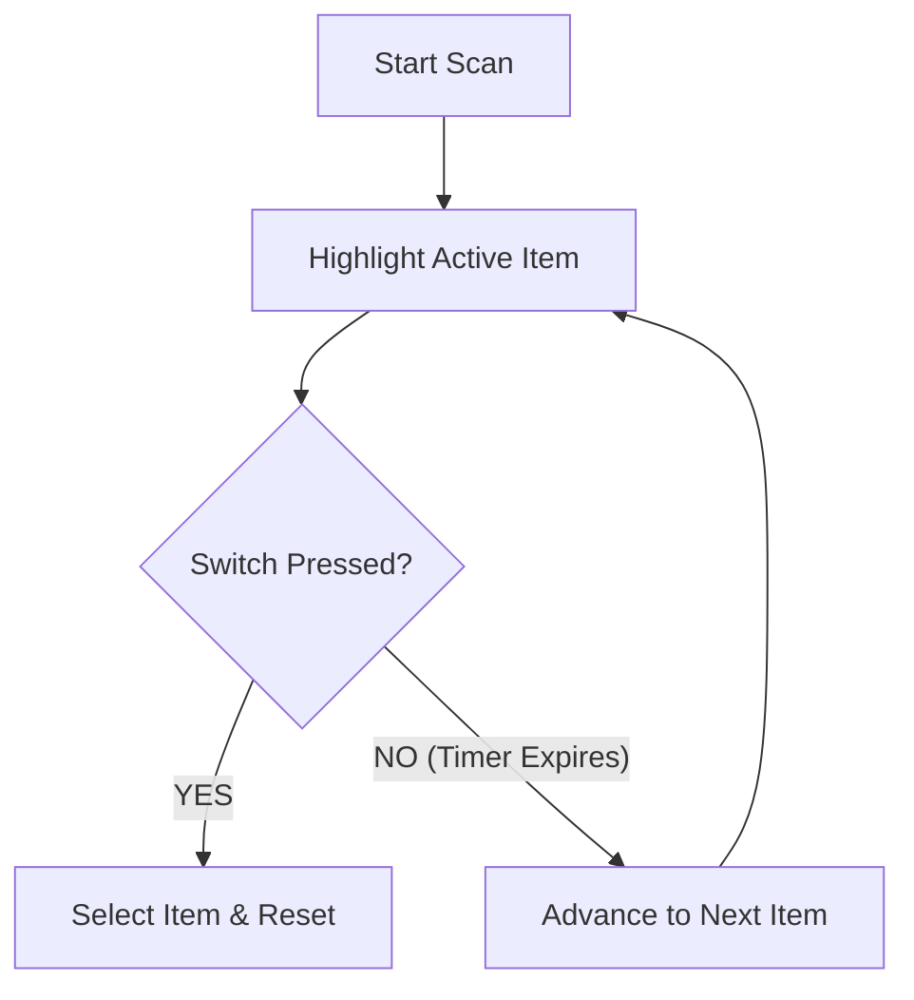

# Chapter 5: Single Switch Scanning

**Single Switch Scanning (Auto-Scan)** is the most common scanning access method in assistive technology.

## Core Operational Mechanics

1. **Sequential Highlighting:** The software automatically moves a visual/auditory highlight across selectable items at a predetermined rate (*Scan Rate*, `T_scan`).
2. **User Anticipation & Activation:** The user waits for their target item to be highlighted and depresses their single switch.
3. **Selection Execution:** The system triggers the target action, provides confirmation feedback, and resets or advances the scan cycle.

## System-Paced Timing vs Motor Control

In standard auto-scan, the system dictates the tempo. This introduces **timing pressure**: the user must anticipate the arriving highlight and execute their switch press within a narrow temporal window (Steriadis & Constantinou, 2003).

- **Scan Rate Too Fast:** Results in late-press timing errors, missed items, and user anxiety.
- **Scan Rate Too Slow:** Results in excessive dead time, low Text Entry Rate (TER), and visual search fatigue.
- **Optimal Scan Rate:** Set using empirical guidelines such as the **.65 Rule** (`T_scan = RT / 0.65`; see Chapter 13).

## Key Auto-Scan Variations

Commercial AAC devices and access software incorporate specialized auto-scan behavior to match individual motor profiles:

- **Standard Auto-Scan (Press-to-Select):** System moves highlight automatically; switch press selects the active item.
- **Auto-While-Held (Inverse / User Scan):** The highlight moves *only* while the user holds the switch down. Releasing the switch selects the item.
  - *Clinical Benefit:* Ideal for users who experience panic or freezing under timing pressure. If they release the switch, the scan stops immediately instead of continuing past the target.
- **Initial Item Pause (1st-Item Delay):** Adds extra pause time (250–500 ms) on the first item of a scan loop to give the user time to orient visually before the scan accelerates.
- **Scan Loop Limit:** Automatically stops the scan after multiple complete passes (typically 2–3 passes) to prevent endless background cycling when the user rests.

## Selection Trigger Methods

Beyond standard switch presses, auto-scanning can employ alternative trigger logic:

- **Press-to-Select:** Most common; immediate activation on switch closure.
- **Dwell Selection:** Selection occurs automatically if the highlight remains on an item for a threshold duration without requiring any physical switch press (useful for low-force proximity switches or eye gaze).
- **Encoded / Long-Hold Actions:** Holding the switch down beyond a threshold (e.g., 1000 ms) triggers secondary commands such as "Cancel Scan" or "Back to Main Menu" (see Chapter 19).

## Interactive Demo

  🎮 Try it: Wait for item <strong>7</strong> to highlight, then press Space or click to select it!

  <switch-scanner theme="sketch" scan-pattern="linear" scan-technique="point" scan-rate="1000" grid-size="9"></switch-scanner>

  <strong>Takeaway:</strong> Auto-scan requires zero motor movement beyond a single binary press, but places high demands on timing precision and visual search.

