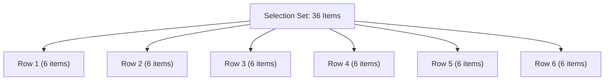

# Chapter 7: Why Group?

Linear scanning of large selection sets is painfully inefficient. As selection sets grow beyond 10 items, linear scanning becomes unusable for communication or computer access. 

**Grouping** organizes items into hierarchical layers, dramatically reducing the average number of scan steps required per selection.

## The Mathematics of Scan Cost

In a linear scan across `N` items, the scan cost `S` (number of scan steps to reach a target) is proportional to grid size:

- **Best-case cost:** 1 press (first item).
- **Worst-case cost:** `N` presses (last item).
- **Average cost (`S_linear`):** `S_linear = (N + 1) ÷ 2`

| Grid Size (`N`) | Linear Max Cost | Linear Average Cost (`S`) |
| --- | --- | --- |
| 4 items | 4 presses | 2.5 presses |
| 16 items | 16 presses | 8.5 presses |
| 36 items | 36 presses | 18.5 presses |
| 64 items | 64 presses | 32.5 presses |
| 100 items | 100 presses | 50.5 presses |

To select a single character in a 64-item grid using linear auto-scan at 1000 ms per step, the user must wait an average of **32.5 seconds per selection**—yielding a maximum Text Entry Rate of under **0.3 Words Per Minute**!

<div class="info-box">
  💡 <strong>In Plain English (The Elevator vs. Single Line Analogy):</strong><br />
  Linear scanning is like walking down a single long hallway with 36 doors—you must pass door #1, door #2, door #3 all the way to door #36. On average, you'll walk past 18 doors before finding your item.<br /><br />
  Grouping is like taking an elevator. First, you pick the floor (Rows 1 to 6), then you step down that short hallway (Columns 1 to 6). Instead of passing up to 36 doors, you take at most 12 steps. For your client, that cuts waiting time by over 60%!
</div>

## How Grouping Reduces Complexity

Grouping breaks a single 1D linear array into a **hierarchical multi-stage search tree**:



By dividing an `N`-item grid into a square `R × C` matrix (where `R = sqrt(N)` and `C = sqrt(N)`), the selection process becomes a 2-stage decision:
1. **Stage 1:** Scan `R` row groups $\rightarrow$ select row.
2. **Stage 2:** Scan `C` items within chosen row $\rightarrow$ select item.

The average scan cost for Row-Column scanning (`S_row_col`) drops to:

`S_row_col = (R + 1) ÷ 2 + (C + 1) ÷ 2 = sqrt(N) + 1`

## Efficiency Comparison: 36 Items (6×6 Matrix)

- **Linear Scan Average Cost:** 18.5 steps.
- **Row-Column Average Cost:** 7.0 steps (6 rows + 6 columns average).
- **Scan Step Savings:** **> 60% reduction in waiting time!**

```text
Linear Scan Cost:    [■■■■■■■■■■■■■■■■■■.5] (18.5 steps)
Row-Column Cost:     [■■■■■■■] (7 steps)  <-- 62% Faster!
```

<div class="highlight-box">
  🩺 <strong>Clinical Impact:</strong> Grouping transforms search complexity from linear <code>O(N)</code> to square-root <code>O(sqrt(N))</code> or logarithmic <code>O(log N)</code>. This is the single most effective software intervention for increasing Text Entry Rate in AAC (Lesher et al., 1998).
</div>

## Cognitive & Visual Search Benefits

Beyond raw timing speed, grouping provides major cognitive advantages:

1. **Reduced Visual Search Field:** The user only needs to track one active row banner during Stage 1, rather than following a rapidly hopping single-cell target across the screen (Thistle & Wilkinson, 2015).
2. **Chunking & Spatial Memory:** Grouping supports spatial memory, allowing users to memorize target locations (e.g., "Top-Right quadrant" or "Row 2, Column 3").
3. **Ergonomic Layout Weighting:** High-frequency items (like vowels, Space, or common AAC phrases) can be placed in Row 1, Column 1, reducing average selection time even further.

<div class="info-box">
  Next Chapter: In <strong>Chapter 8</strong>, we examine the practical mechanics, timing flows, and visual techniques (Block vs. Point) for implementing Row-Column scanning.
</div>
