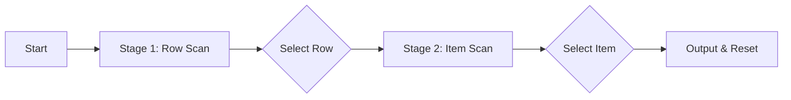

# Chapter 8: Row-Column Scanning

**Row-Column Scanning** is the most widely used grouped scanning technique in AAC communication software and accessibility operating systems.

## Two-Stage Selection Sequence

Row-column scanning breaks item selection into two distinct, sequential stages:

1. **Stage 1 (Row Scan):** The system scans entire rows top-to-bottom. The user activates their switch when the row containing their target item lights up.
2. **Stage 2 (Column / Item Scan):** The selected row remains active, and the scan steps through individual items left-to-right within that row. The user activates their switch to confirm the target item.

## Highlighting Techniques: Block vs. Point

When scanning rows in Stage 1, how should the active row be visually presented to the user?

### 1. Block Technique (Group Highlight)
In the **Block Technique**, the entire horizontal row (all cells and background colors) lights up as a solid, high-contrast banner.

- **Pros:** Maximum visual clarity, easily identifiable from a distance or by users with low vision / central field loss.
- **Cons:** High visual motion; large illuminated area can cause visual glare or fatigue on bright screens.
- **Best For:** Beginners, young learners, low-vision users, and initial clinical evaluations.

### 2. Point Technique (Indicator Highlight)
In the **Point Technique**, only a small indicator marker (such as a arrow, dot, or thin border halo on the row header) highlights during Stage 1.

- **Pros:** Minimal visual noise and screen motion; keeps individual cell contents fully visible without background color wash.
- **Cons:** Requires higher visual acuity to track the small indicator marker.
- **Best For:** Experienced switch users, dense AAC keyboards (64+ cells), and high-speed scanning.

  <strong>Clinical Guideline:</strong> Begin new switch users with the <strong>Block Technique</strong> to build confidence in row selection. Once the user understands two-stage scanning, evaluate whether <strong>Point Technique</strong> reduces visual fatigue.

## Interactive Comparison: Block vs. Point Technique

  🎮 Compare how rows are highlighted in Block mode (left) versus Point mode (right).

  

    <h4>Block Technique</h4>
    

      <switch-scanner theme="sketch" scan-pattern="row-column" scan-technique="block" scan-rate="1200" grid-size="16"></switch-scanner>
    

  

  

    <h4>Point Technique</h4>
    

      <switch-scanner theme="sketch" scan-pattern="row-column" scan-technique="point" scan-rate="1200" grid-size="16"></switch-scanner>
    

  

## Common Clinical Variants

- **Column-Row Scanning:** Scans columns left-to-right first, then items top-to-bottom within the selected column. Preferred for vertical list layouts or wide aspect screens.
- **Group-Row-Column:** Adds a 3rd top layer (e.g., Pages/Tabs $\rightarrow$ Rows $\rightarrow$ Columns) for massive selection sets (100+ items).
- **1st-Item Delay:** Adds a 250–500 ms pause on the first cell when transitioning from Stage 1 to Stage 2, preventing missed column selections (see Chapter 13).
