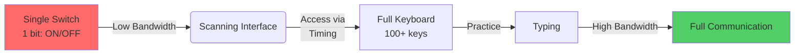
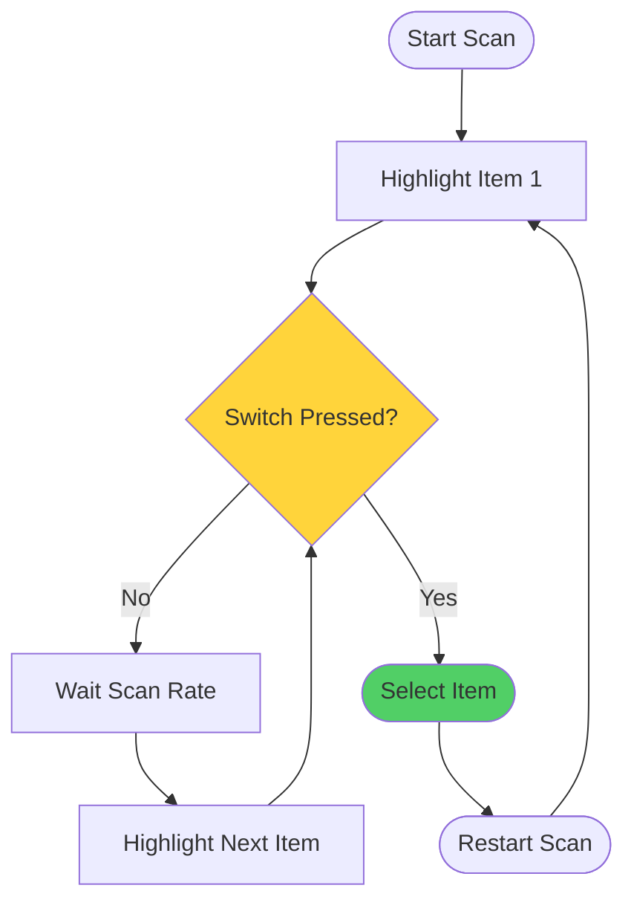
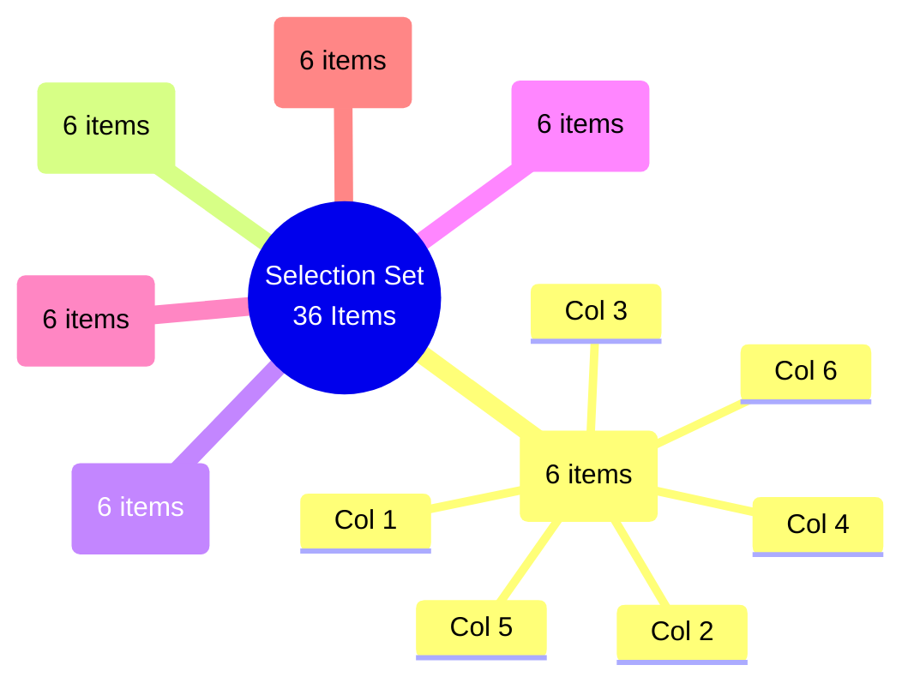
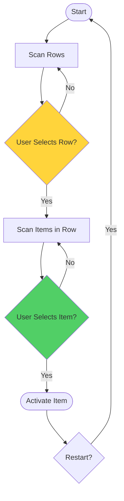
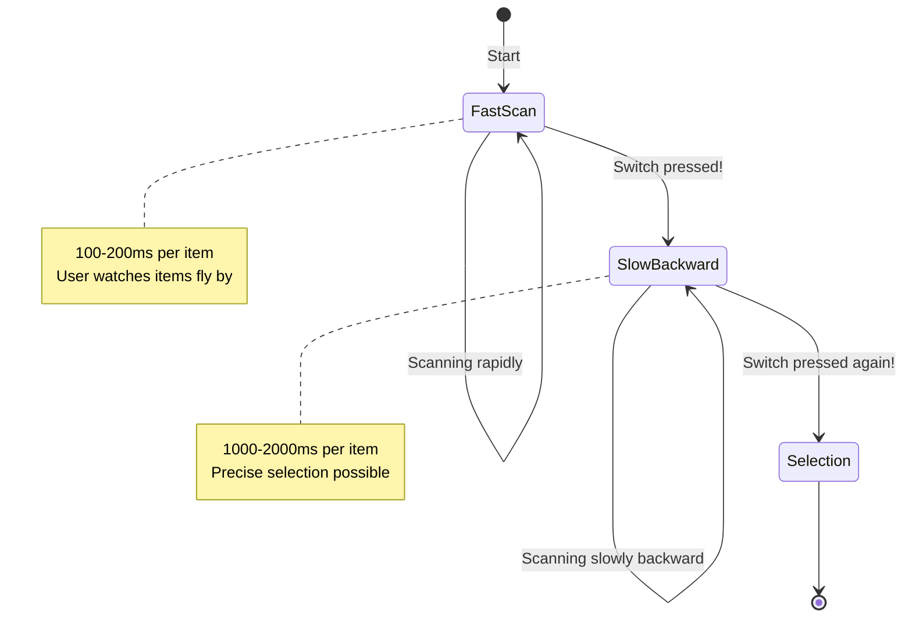

# Switch Scanning: The Interactive Book
**Target Audience**: Developers, UX Designers, Clinical Scientists, Occupational Therapists

---

## Table of Contents

### Part I: Foundations
1. [What is a Switch?](#chapter-1-what-is-a-switch)
2. [The Bandwidth Problem](#chapter-2-the-bandwidth-problem)
3. [Cause & Effect](#chapter-3-cause--effect)
4. [Selection Sets](#chapter-4-selection-sets)

### Part II: Basic Scanning
5. [Single Switch Scanning](#chapter-5-single-switch-scanning)
6. [Two Switch Scanning](#chapter-6-two-switch-scanning)
7. [Timing & Pacing](#chapter-7-timing--pacing)

### Part III: Grouping & Efficiency
8. [Why Group?](#chapter-8-why-group)
9. [Row-Column Scanning](#chapter-9-row-column-scanning)
10. [Elimination Scanning](#chapter-10-elimination-scanning)

### Part IV: Advanced Techniques
11. [Continuous Scanning](#chapter-11-continuous-scanning)
12. [Critical Overscan](#chapter-12-critical-overscan)
13. [Directed Scanning](#chapter-13-directed-scanning)

### Part V: User-Centered Design
14. [Error Recovery](#chapter-14-error-recovery)
15. [Feedback & Highlighting](#chapter-15-feedback--highlighting)
16. [User Profiles](#chapter-16-user-profiles)

### Part VI: For Developers
17. [Implementing Scanners](#chapter-17-implementing-scanners)
18. [Accessibility Testing](#chapter-18-accessibility-testing)
19. [Design Patterns](#chapter-19-design-patterns)

---

## Chapter 1: What is a Switch?

### Learning Objectives
- Understand what a switch is
- Learn about different types of switches
- Recognize that switches are binary input devices

### Content

A **switch** is an assistive technology device that provides a simple binary input: **ON** or **OFF**. Unlike a keyboard which offers many keys, or a mouse which offers X/Y coordinates, a switch is the simplest possible input mechanism.

**Physical Switch Types:**

1. **Button Switches** - Large or small buttons that can be pressed with any body part
2. **Joystick Switches** - Directional switches activated by tilting
3. **Pressure Pads** - Activated by leaning or pressing
4. **Puff/Sip Switches** - Controlled by breath (puffing or sipping through a tube)
5. **Muscle Sensors** - Detect muscle contraction (e.g., eyebrow raise)
6. **Beam Switches** - Broken by hand or body movement through an infrared beam

**Why Switches Matter:**

For people with severe physical disabilities, a switch may be the ONLY reliable voluntary movement they can perform. Scanning transforms this single binary input into full access to technology.

### Interactive Demo
```
┌─────────────────────────────────────┐
│  Try pressing the switch:           │
│  [  SWITCH BUTTON  ]                │
│                                     │
│  State: ● OFF (default)             │
│  State: ● ON (when pressed)         │
└─────────────────────────────────────┘
```

---

## Chapter 2: The Bandwidth Problem

### Learning Objectives
- Understand input bandwidth concept
- Recognize the challenge switch users face
- Learn why scanning is necessary

### Content

**Input Bandwidth** refers to the amount of information a user can transmit per unit of time.

```
High Bandwidth    │  Medium Bandwidth  │  Low Bandwidth
────────────────────────────────────────────────────
Touch Typist      │  Hunt & Peck       │  Switch User
(10+ fingers,     │  (1-2 fingers,     │  (1 binary input,
 high speed)       │  low speed)         │  timing-based)
```

**The Sushi Bar Analogy:**

Imagine a sushi bar where dishes rotate past you on a conveyor belt. You cannot reach everything at once—you must wait for the dish you want to come to you, then grab it quickly.

**Switch users trade TIME for ACCESS.**

They don't have instant access to any item like a mouse user. They must wait for the scan to reach the item they want, then activate their switch at precisely the right moment.

### Interactive Visualization



**Takeaway:** Scanning is slow but powerful. It gives switch users access to ALL items, just not instantly.

---

## Chapter 3: Cause & Effect

### Learning Objectives
- Understand the foundational concept of switch use
- Learn how switch press connects to outcome
- Build confidence through predictable feedback

### Content

Before scanning, users must understand **Cause and Effect**: "When I activate my switch, something happens."

This is the foundation of all switch use. Without understanding this connection, scanning makes no sense.

**The Learning Progression:**

1. **Random Activation** - User accidentally activates switch, notices something happens
2. **Intentional Activation** - User purposefully activates switch to see effect
3. **Timed Activation** - User learns to activate at specific moments
4. **Controlled Activation** - User activates to select specific items (scanning!)

### Interactive Demo 1: Simple Cause & Effect

**Try it:** Press Space or click "Select" to play music!

```html
<switch-scanner
    scan-mode="cause-effect"
    grid-cols="1"
    custom-items='[{"label":"🎵 Play Music!", "id":"play"}]'>
</switch-scanner>
```

**What's happening:**
- Only 1 item available
- Switch press ALWAYS triggers it
- User learns: My press → Effect happens
- Builds confidence and understanding

### Interactive Demo 2: Visual Feedback

**Try it:** Press Space to see the effect!

```html
<switch-scanner
    scan-mode="cause-effect"
    grid-cols="1"
    custom-items='[{"label":"Make it BOUNCE!", "id":"bounce"}]'>
</switch-scanner>
```

---

## Chapter 4: Selection Sets

### Learning Objectives
- Understand what a selection set is
- Learn different presentation formats
- Choose appropriate format for different scenarios

### Content

A **Selection Set** is all the items available for the user to choose from at any given time.

**Example Selection Sets:**
- Alphabet keyboard (26 letters)
- On-screen keyboard (letters + numbers + symbols)
- Communication device (words, phrases, pictures)
- TV remote (channels, volume, power)
- Menu options (File, Edit, View, etc.)

### Presentation Formats

#### 1. Single Line Presentation
Items arranged in a single row (horizontal or vertical)

**Best for:** Small sets (<10 items), simple choices

**Example:**
```
┌──────────────────────────────────┐
│  Yes  │  No  │  Maybe  │  Later  │
└──────────────────────────────────┘
```

#### 2. Grid Presentation
Items arranged in a 2D grid

**Best for:** Large sets, organized layouts

**Example:**
```
┌────┬────┬────┬────┐
│ A  │ B  │ C  │ D  │
├────┼────┼────┼────┤
│ E  │ F  │ G  │ H  │
├────┼────┼────┼────┤
│ I  │ J  │ K  │ L  │
└────┴────┴────┴────┘
```

#### 3. Flip Chart Presentation
Items shown one at a time, like a rotating card

**Best for:** Very large sets, reducing cognitive load

**Example:**
```
┌──────────────────┐
│                  │
│     [ A ]        │  ← Only ONE item visible
│                  │
│   (Next: B)      │
└──────────────────┘
```

#### 4. Pop-up Presentation
Secondary pages appear "within" current page temporarily

**Best for:** Contextual options, related items

#### 5. Custom Presentation
Non-standard layouts with emphasis on important items

### Interactive Demo: Different Set Sizes

**Demo 1: Small Set (4 items) - Single Line**
```html
<switch-scanner
    scan-pattern="linear"
    scan-technique="point"
    grid-cols="4"
    custom-items='[
        {"label":"Red", "backgroundColor":"#ffcccc"},
        {"label":"Blue", "backgroundColor":"#ccccff"},
        {"label":"Green", "backgroundColor":"#ccffcc"},
        {"label":"Yellow", "backgroundColor":"#ffffcc"}
    ]'>
</switch-scanner>
```

**Demo 2: Medium Set (16 items) - Grid**
```html
<switch-scanner
    scan-pattern="linear"
    scan-technique="point"
    grid-size="16">
</switch-scanner>
```

**Demo 3: Large Set (64 items) - Grid**
```html
<switch-scanner
    scan-pattern="linear"
    grid-size="64">
</switch-scanner>
```

**Notice:** How much longer it takes to scan through 64 items!
This is why we need **grouping** (Chapter 8).

---

## Chapter 5: Single Switch Scanning

### Learning Objectives
- Understand auto-scan mechanism
- Learn timing and rhythm
- Practice single-switch selection

### Content

**Single Switch Scanning (Auto-Scan)** is the most common scanning method.

**How it works:**
1. System automatically highlights items in sequence
2. User waits for desired item to be highlighted
3. User presses switch to select
4. System activates item and restarts scan

### The Auto-Scan Flow



### Interactive Demo

**Try it:** Press Space when your desired item is highlighted!

```html
<switch-scanner
    scan-pattern="linear"
    scan-technique="point"
    scan-rate="1000"
    grid-size="9">
</switch-scanner>
```

**Challenge:** Can you select the number 7?

**Timing Tips:**
- **Too fast** = User misses items, can't react in time
- **Too slow** = Frustrating, takes too long
- **Just right** = User feels in control, not rushed

---

## Chapter 6: Two Switch Scanning

### Learning Objectives
- Understand step scanning
- Compare auto-scan vs step scanning
- Learn when to use each method

### Content

**Two Switch Scanning (Step Scan)** gives the user more control over timing.

**How it works:**
- **Switch 1 (Advance)**: Move to next item
- **Switch 2 (Select)**: Choose current item

### Comparison

| Feature | Auto-Scan (1 Switch) | Step Scan (2 Switches) |
|---------|---------------------|------------------------|
| Timing control | System controls | User controls |
| Cognitive load | Must watch timing | No timing pressure |
| Physical effort | 1 switch | 2 switches |
| Speed | Fixed | Variable (user-paced) |
| Best for | Single switch users | Users with good motor control |

### Interactive Demo

**Try it:** Use Key '2' to move, Space to select!

```html
<switch-scanner
    scan-input-mode="manual"
    scan-pattern="linear"
    scan-technique="point"
    grid-size="9"
    custom-items='[
        {"label":"🍎 Apple", "id":"apple"},
        {"label":"🍌 Banana", "id":"banana"},
        {"label":"🍇 Grapes", "id":"grapes"},
        {"label":"🍊 Orange", "id":"orange"},
        {"label":"🍓 Strawberry", "id":"strawberry"},
        {"label":"🍉 Watermelon", "id":"watermelon"},
        {"label":"🍑 Peach", "id":"peach"},
        {"label":"🍒 Cherry", "id":"cherry"},
        {"label":"🍋 Lemon", "id":"lemon"}
    ]'>
</switch-scanner>
```

**Advantage:** No time pressure! Move at your own pace.

---

## Chapter 7: Timing & Pacing

### Learning Objectives
- Understand scan rate and its impact
- Learn about dwell time and acceptance time
- Optimize timing for different users

### Content

**Timing is everything in scanning.** Too fast = errors. Too slow = frustration.

### Key Timing Parameters

#### 1. Scan Rate
Time between item highlights (typically 500ms - 2000ms)

```mermaid
gantt
    title Scan Rate Timeline (1000ms)
    dateFormat X
    axisFormat %L

    section Items
    Item 1 Highlighted :active, i1, 0, 1000
    Item 2 Highlighted :active, i2, 1000, 2000
    Item 3 Highlighted :active, i3, 2000, 3000
    Item 4 Highlighted :active, i4, 3000, 4000
```



**Demo - Different Scan Rates:**

**Fast (500ms):**
```html
<switch-scanner
    scan-pattern="linear"
    scan-rate="500"
    grid-size="9">
</switch-scanner>
```

**Medium (1000ms):**
```html
<switch-scanner
    scan-pattern="linear"
    scan-rate="1000"
    grid-size="9">
</switch-scanner>
```

**Slow (2000ms):**
```html
<switch-scanner
    scan-pattern="linear"
    scan-rate="2000"
    grid-size="9">
</switch-scanner>
```

#### 2. Acceptance Time
Time switch must be held to confirm selection (prevents accidental activation)

#### 3. Initial Item Pause
Extended highlight on first item (gives user time to prepare)

#### 4. Dwell Time
Auto-select if highlight stays on item for X milliseconds (no switch press needed!)

**Demo - Dwell Selection:**
```html
<switch-scanner
    scan-pattern="linear"
    dwell-time="1500"
    grid-size="9">
</switch-scanner>
```

Just wait on an item for 1.5 seconds and it selects automatically!

---

## Chapter 8: Why Group?

### Learning Objectives
- Understand the problem with large selection sets
- Learn how grouping reduces scan time
- Calculate scan cost for different layouts

### Content

**The Problem:** Linear scanning of large sets is painfully slow.

**Scan Cost Calculation:**

For N items in linear scan:
- Average cost to select any item = **N/2**
- Cost to select last item = **N**

**Example:**
- 26 letters (alphabet) = Average cost: 13 presses
- 64 items = Average cost: 32 presses!
- 100 items = Average cost: 50 presses 😱

**The Solution:** Grouping reduces scan cost dramatically.

### How Grouping Works

Instead of scanning every single item, we scan **groups** first.

**Example: Row-Column Scanning of 36 items (6×6 grid)**

**Linear Scan:**
- Scan all 36 items
- Average cost: 18 presses

**Row-Column Scan:**
- Scan 6 rows (6 options)
- Scan 6 items in selected row (6 options)
- Maximum cost: 6 + 6 = **12 presses**
- Average cost: **9 presses**

**That's 50% faster!**

### Hierarchy Visualization



---

## Chapter 9: Row-Column Scanning

### Learning Objectives
- Understand row-column scanning
- Learn block vs point techniques
- Practice two-stage selection

### Content

**Row-Column Scanning** is the most common grouped scanning method.

### How It Works

**Stage 1: Row Selection**
- System highlights each ROW
- User selects desired row

**Stage 2: Item Selection**
- System highlights items within selected ROW
- User selects desired item

### The Flow



### Block vs Point Technique

**Block Technique:**
- Highlights ENTIRE row as solid block
- Easier to see
- Better for larger items

**Point Technique:**
- Highlights just the row indicator
- Less visual clutter
- Better for dense grids

### Interactive Demo

**Try it:** Watch the rows scan first, then items within the row!

```html
<switch-scanner
    scan-pattern="row-column"
    scan-technique="block"
    grid-size="16">
</switch-scanner>
```

**Notice:**
1. First pass: Rows highlight (entire rows light up)
2. Select a row: Now items within that row scan
3. Select item: Item activates, scan restarts

---

## Chapter 10: Elimination Scanning

### Learning Objectives
- Understand elimination scanning concept
- Learn about binary elimination
- Compare efficiency with row-column

### Content

**Elimination Scanning** is the fastest scanning method for large grids.

### How It Works

Instead of scanning items or rows, we **eliminate** portions of the grid.

**Example: 4-Switch Elimination (Quadrant Scanning)**

With 64 items (8×8 grid):

**Stage 1:** Split grid into 4 quadrants
- User selects quadrant (now down to 16 items)

**Stage 2:** Split quadrant into 4 sub-quadrants
- User selects sub-quadrant (now down to 4 items)

**Stage 3:** Individual items
- User selects item

**Maximum cost: 3 selections!**
(Compared to 64 for linear scan!)

### Efficiency Comparison

For 64 items:

| Method | Max Presses | Average Presses |
|--------|-------------|-----------------|
| Linear | 64 | 32 |
| Row-Column (8×8) | 16 | 9 |
| Elimination (4-switch) | 3 | 3 |

### Interactive Demo

**Try it:** Experience the speed of elimination scanning!

```html
<switch-scanner
    scan-pattern="elimination"
    elimination-switch-count="4"
    grid-size="64">
</switch-scanner>
```

**What to observe:**
1. First scan: Grid splits into 4 colored quadrants
2. Select a quadrant: It splits into 4 sub-quadrants
3. Select sub-quadrant: Individual items appear
4. Select item: Done!

**Advanced:** Try with 2 switches (binary), 3 switches, up to 8 switches!

---

## Chapter 11: Continuous Scanning

### Learning Objectives
- Understand continuous movement
- Learn gliding cursor vs crosshair
- Practice precise timing control

### Content

**Continuous Scanning** mimics mouse-like movement for switch users.

### How It Works

Instead of discrete steps, the highlight moves **continuously** across the grid.

**Techniques:**

#### 1. Gliding Cursor
Highlight moves smoothly in a continuous path with "buffer zones" at edges

#### 2. Crosshair
Two lines (horizontal and vertical) scan independently
- User selects when both lines intersect on desired item

#### 3. Eight-Direction (Compass)
Highlight moves in 8 directions (N, NE, E, SE, S, SW, W, NW)

### Interactive Demo

**Try it:** Watch the continuous movement!

```html
<switch-scanner
    scan-mode="continuous"
    continuous-technique="gliding">
</switch-scanner>
```

**Challenge:** Continuous scanning requires very precise timing!
- Too early = wrong item
- Too late = miss and wait for next pass

---

## Chapter 12: Critical Overscan

### Learning Objectives
- Understand critical overscan technique
- Learn when it's useful
- Practice two-stage selection

### Content

**Critical Overscan** provides rapid access to large sets.

### How It Works

**Stage 1: Fast Forward Scan**
- System scans VERY quickly (100-200ms per item)
- User watches items fly by

**Stage 2: Slow Backward (on switch press)**
- User presses switch when desired item passes
- System reverses and scans SLOWLY through items
- User can now select precisely

### The Flow



### Interactive Demo

**Try it:**
1. Let items fly by (fast!)
2. Press Space when you see your item go past
3. Watch it slow down and come back
4. Press Space again to select!

```html
<switch-scanner
    scan-pattern="linear"
    critical-overscan-enabled="true"
    critical-overscan-fast-rate="150"
    critical-overscan-slow-rate="1500"
    grid-size="36">
</switch-scanner>
```

---

## Chapter 13: Directed Scanning

### Learning Objectives
- Understand joystick-style scanning
- Learn direction control
- Compare with auto-scan

### Content

**Directed Scanning** gives users direct control over highlight direction.

### How It Works

User controls which direction the highlight moves:
- Up, Down, Left, Right (and diagonals)
- Like using a joystick or arrow keys

### Switch Configurations

**Natural Setup (4+ switches):**
- Switch for each direction
- Very intuitive but requires many switches

**Reduced Switch (2 switches):**
- Switch 1: Move Right
- Switch 2: Move Down
- Wraps around edges

### Interactive Demo

**Try it:** Use arrow keys to move freely!

```html
<switch-scanner
    scan-mode="continuous"
    continuous-technique="eight-direction"
    compass-mode="fixed-8">
</switch-scanner>
```

---

## Chapter 14: Error Recovery

### Learning Objectives
- Understand why errors are costly for switch users
- Learn error recovery methods
- Implement cancellation and reset

### Content

**The Problem:** For switch users, errors are VERY expensive.

**Example:**
- Mouse user: Clicks wrong item → 1 second to correct
- Switch user: Selects wrong item → May take 30+ seconds to scan again and fix

### Error Recovery Methods

#### 1. Empty Items
Special items that don't trigger output, just reset the scan

**Demo:**
```html
<switch-scanner
    scan-pattern="linear"
    allow-empty-items="true"
    grid-size="10"
    custom-items='[
        {"label":"A"},
        {"label":"B"},
        {"label":"⟳ Reset", "isEmpty": true},
        {"label":"C"}
    ]'>
</switch-scanner>
```

#### 2. Long-Hold Cancel
Hold switch for 1+ seconds to cancel scan

#### 3. Cancel Button
Dedicated button to cancel current scan cycle

#### 4. Undo/Redo
Reverse last action (character, word, or operation)

---

## Chapter 15: Feedback & Highlighting

### Learning Objectives
- Understand visual feedback options
- Learn about auditory highlighting
- Design effective feedback systems

### Content

**Good feedback is essential for switch users.**

### Visual Highlighting Options

#### 1. Color Changes
Change background color of highlighted item

#### 2. Border/Outline Emphasis
Add thick outline (what we've been using!)

#### 3. Size Changes
Make highlighted item larger (scale up)

#### 4. Opacity Changes
Dim non-highlighted items

#### 5. Animation
Pulse, bounce, or shake highlighted item

### Interactive Demo: Customize Highlight

**Try it:** Adjust the visualization settings!

```html
<switch-scanner
    highlight-border-width="8"
    highlight-border-color="#FF0000"
    highlight-scale="1.2"
    highlight-opacity="0.8"
    highlight-animation="true"
    scan-pattern="linear"
    grid-size="16">
</switch-scanner>
```

**Experiment with:**
- Border width (0-10px)
- Border color (any CSS color)
- Scale (1.0-1.5, larger = zoom effect)
- Opacity (0.3-1.0)
- Animation (pulse effect)

### Auditory Highlighting

- **Scan sounds:** Beep when item highlights
- **Selection sounds:** Different sound when selected
- **Voice output:** Speak item names as they highlight
- **Pitch variations:** Higher pitch = closer to target

---

## Chapter 16: User Profiles

### Learning Objectives
- Understand different user needs
- Learn appropriate configurations for each profile
- Create user-centered scanner designs

### Content

Different users have different needs based on their abilities.

### User Profiles

#### Profile 1: Athetosis (Involuntary Movement)
**Challenges:** Tremors, accidental double-taps, muscle spasms

**Solutions:**
- High debounce threshold (filter out tremors)
- Long acceptance time (require sustained hold)
- Dwell selection (no precise timing needed)

#### Profile 2: Degenerative Conditions (MND/ALS)
**Challenges:** Progressive weakness, fatigue over time

**Solutions:**
- Switch alternation (balance load across switches)
- Scan loops (prevent infinite waiting)
- Auto-repeat (reduce repetitive presses)
- Adjustable speed (slow down as fatigue increases)

#### Profile 3: Visual Impairment
**Challenges:** Difficulty tracking highlight

**Solutions:**
- Auditory highlighting (speak item names)
- Large highlights (thick borders, big scale)
- High contrast colors
- Sound cues on every highlight

#### Profile 4: Cognitive Loading
**Challenges:** Overwhelmed by large grids, complex hierarchies

**Solutions:**
- Smaller selection sets (<10 items per page)
- Shallow hierarchy (max 2-3 levels)
- Clear visual grouping
- Predictable scan patterns

---

## Chapter 17: Implementing Scanners

### Learning Objectives (For Developers)
- Understand scanner architecture
- Learn to implement new scan patterns
- Build accessible scanning interfaces

### Content

**Scanner Implementation Pattern:**

```typescript
abstract class Scanner {
  protected currentIndex: number;
  protected isRunning: boolean;

  // Core methods
  abstract step(): void;           // Move to next item/group
  abstract reset(): void;          // Restart scan
  abstract doSelection(): void;    // Perform selection

  // Control
  start() { ... }
  stop() { ... }
  handleAction(action) { ... }

  // Timing
  scheduleNextStep() { ... }
}
```

### Implementing a New Scanner Pattern

**Example: Snake Scan**

```typescript
class SnakeScanner extends LinearScanner {
  protected step() {
    const config = this.config.get();
    const cols = Math.floor(Math.sqrt(this.totalItems));

    this.currentIndex++;

    // Check if we hit a row boundary
    const atRowEnd = (this.currentIndex % cols === 0);
    if (atRowEnd && this.currentIndex < this.totalItems) {
      // Continue to next row (no wrap)
    } else if (this.currentIndex >= this.totalItems) {
      // Wrap to start
      this.currentIndex = 0;
      this.reportCycleCompleted();
    }

    this.renderer.setFocus([this.currentIndex]);
  }
}
```

### Key Design Principles

1. **Configurable timing** - All timing should be user-adjustable
2. **Clear feedback** - Always show current state
3. **Error recovery** - Provide ways to cancel/undo
4. **Test with real users** - Lab testing ≠ real world

---

## Chapter 18: Accessibility Testing

### Learning Objectives
- Learn how to test scanning interfaces
- Understand switch user testing methods
- Identify and fix common issues

### Content

### Testing Methods

#### 1. Single-Switch Simulation
**Method:** Use only Space bar to test everything

**What to test:**
- Can you reach ALL features?
- How long does it take to complete common tasks?
- Are there any "dead ends"?

#### 2. Timing Testing
**Method:** Test at different scan rates (500ms, 1000ms, 2000ms)

**What to test:**
- Is the minimum speed usable?
- Is the maximum speed too slow?
- Is there a "sweet spot" for most users?

#### 3. Error Scenario Testing
**Method:** Make mistakes intentionally and test recovery

**What to test:**
- Can you cancel a scan easily?
- Can you undo mistakes?
- Can you reset without starting over?

#### 4. Fatigue Testing
**Method:** Use the interface for 30+ minutes continuously

**What to test:**
- Does fatigue cause more errors?
- Can speed be adjusted on the fly?
- Is mental fatigue an issue?

### Common Issues to Watch For

❌ **Too fast** - User can't react in time
❌ **No feedback** - User doesn't know what's selected
❌ **No undo** - Mistakes are catastrophic
❌ **Infinite loops** - User waits forever for item to return
❌ **Small targets** - Highlights hard to see
❌ **Poor contrast** - Can't distinguish highlighted vs non-highlighted

---

## Chapter 19: Design Patterns

### Learning Objectives
- Learn proven design patterns for scanning
- Apply patterns to new contexts
- Avoid common pitfalls

### Content

### Pattern 1: Progressive Disclosure

**Problem:** Overwhelming user with too many options

**Solution:** Show only relevant options, reveal more as needed

```html
<!-- Level 1: Categories -->
<switch-scanner id="categories">
  [Letters] [Numbers] [Symbols] [Words]
</switch-scanner>

<!-- Level 2: Letters (revealed after selecting "Letters") -->
<switch-scanner id="letters">
  [A-Z]
</switch-scanner>
```

### Pattern 2: Most Recently Used (MRU)

**Problem:** User frequently selects same items

**Solution:** Put recently used items at front of scan

```javascript
const mruItems = getRecentlyUsed();
const otherItems = getAllItems().filter(i => !mruItems.includes(i));
const orderedItems = [...mruItems, ...otherItems];
```

### Pattern 3: Predictive Scanning

**Problem:** Scan order doesn't match usage frequency

**Solution:** Order items by probability of use

```javascript
// English letter frequency
const frequencyOrder = "ETAOINSHRDLCUMWFGYPBVKJXQZ";

// For alphabet grids, use frequency order instead of A-Z
const gridItems = frequencyOrder.split('');
```

### Pattern 4: Context-Aware Scanning

**Problem:** Different contexts need different items

**Solution:** Change scan content based on application state

```javascript
if (inTextMode) {
  showKeyboard();
} else if (inMenuMode) {
  showMenuItems();
} else if (inBrowserMode) {
  showBrowserControls();
}
```

---

## Appendix A: Quick Reference

### Scan Pattern Decision Tree

```
How many items?
├─ < 10 items
│  └─ Linear Scan (simple, fast)
├─ 10-30 items
│  ├─ Row-Column Scan (standard)
│  └─ Snake Scan (slightly faster)
├─ 30-100 items
│  ├─ Row-Column Scan (good balance)
│  └─ Elimination Scan (fastest, complex)
└─ > 100 items
   ├─ Elimination Scan (4+ switches)
   ├─ Hierarchical (pages + groups)
   └─ Continuous Scan (joystick-style)
```

### Timing Guidelines

| User Profile | Scan Rate | Acceptance Time | Dwell Time |
|--------------|-----------|-----------------|------------|
| Beginner | 1500-2000ms | 500ms | Off |
| Intermediate | 1000-1500ms | 300ms | 1500ms |
| Advanced | 500-1000ms | 150ms | 1000ms |
| Tremors | 1500ms | 800ms | 2000ms |
| Visual Impairment | 2000ms | 500ms | Off |

---

## Appendix B: Glossary

- **Acceptance Time**: Time switch must be held to confirm selection
- **Auto-Scan**: System-controlled highlight progression
- **Binary Elimination**: Splitting selection set in half repeatedly
- **Critical Overscan**: Fast forward scan, slow backward on demand
- **Debounce**: Filtering out rapid accidental switch activations
- **Dwell Time**: Auto-select after highlight duration
- **Elimination Scanning**: Progressive elimination of non-selected portions
- **Group Scan**: Scanning groups first, then items within groups
- **Input Bandwidth**: Information transmission rate (switch = low)
- **Linear Scan**: Sequential item-by-item scanning
- **Progressive Segmentation**: Repeatedly dividing selection set
- **Row-Column Scan**: Scanning rows, then items within row
- **Scan Rate**: Time between item highlights
- **Selection Set**: All items available for selection
- **Step Scan**: User-controlled highlight progression
- **Switch**: Binary input device (ON/OFF)

---

## Appendix C: Resources

### Research Papers
- "Switch Access with a Pointer Interface" - Judge & Colven (ACE Centre)
- "Scanning as a form switch access" - various AAC research

### Tools & Frameworks
- **Grid 3** - Commercial AAC software
- **Communicator 5** - Tobii Dynavox
- **JavaScript Scanner** - This project! 🎉

### Standards & Guidelines
- WCAG 2.1 AAA (Accessibility)
- ISO 24786 (Accessibility of ICT)
- AAC Design Principles

---

## Conclusion

Switch scanning transforms a single binary input into full access to technology. It requires:

1. **Understanding** user needs and abilities
2. **Patience** to find optimal timing and configuration
3. **Creativity** to design efficient scanning patterns
4. **Empathy** to test from the user's perspective

**Remember:** The best scanner is the one that matches the user's abilities, goals, and context. There is no "one size fits all" solution.

**Happy Scanning!** 🎯
